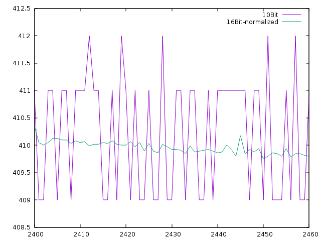
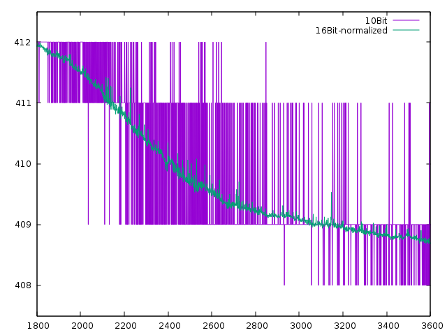
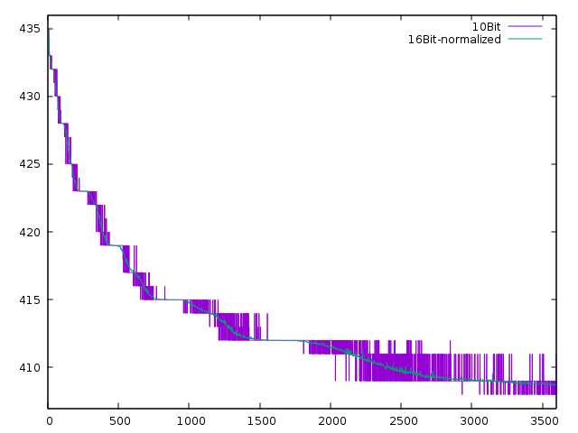

# Arduino ADC Oversampling
This library implements "ENhancing ADC rewsolutino by oversampling" as per [Note AVR121](http://www.atmel.com/images/doc8003.pdf).

For detail information please refer to the application note mentioned above, I will describe here briefly what it says.

## Theory of operation
Oversampling means, sampling a signal over its [Nyquist frequency](https://en.wikipedia.org/wiki/Nyquist_frequency). The Nyquist frequency is at least twice the bandwidth of the input signal.

Sampling above

> **f***nyquist* > 2 * **f***signal*

is called oversampling.

For each additional Bit of resolution **n**, the signal must be **oversampled four times**:

> 4^n

So the oversampling frequency is

> **f***oversampling* = 4^n * **f***nyquist*

Some criteria must be fullfilled in order for oversampling to work properly:

* The signal-component of interest should not vary significantly during a conversion.
* There should be **some noise present** in the signal.
* The amplitude of the noise should be at least 1LSB.

Usually enough noise will be available for this method to work properly, though it might be introduced artificially.

After all the samples are collected, they need to be decimated. This is done by bit shifting the summed result to the right by **n** Bits.

## Implementation
Atmega allows a prescaler to be set for the ADC. By **default** it is set to **128**.
So with a clock of 16MHz, the ADC operates with

> 16,000,000Hz / 128 = 125,000Hz = **125kHz**.

As per datasheet is is safe to set the prescaler as low as **16**, allowing us to clock the ADC with

> 16,000,000Hz / 16 = 1,000,000Hz = **1MHz**

This is one of the first thing done, when you create a new *Oversample* object. This will now apply to **all your analog measurements**.

The ADC provides us with 10 Bit resolution. So to get 11 Bit resolution we need to oversample by:

> 4^n, n= 11 - 10 = 1 => 4 samples.

So in total we will collect 4 samples to achieve 11Bit of resolution.

Lets assume our collected samples look like this:

    0001
    0010
    0010
    0001

All samples are added up to one integer.

    0110

The result is now **scaled by shifting** it to the right by **n** bits, since we can expect them to be non significant:

    0011

The value is now divided by **2^n** to get the normalized value of the decimated value:

     3/2^1 = 1.5

This is the value you obtain through a call to read().

## Usage
Simply clone this repository to your library folder. This repository also contains an example which should show up in your Arduino IDE.

```Arduino
Oversample * sampler;

void setup() {
  /* Initialize sampler inside setup, or the prescaler will not be set properly */
  //sampler = new Oversample(analogPin, resolution);
  sampler = new Oversample(A0, 16);
  double oversampled = sampler->read();
}
```
The library provides getters and setters for resolution and prescaler. Please see the example on how to use them.

## Does it work?
The first time I heard about it, it sounded a bit like magic, so I thought the only way for sure is to try it and compare. I would like to compare it to a **real** 12 and 16 Bit ADC, unfortunately I do not have any on hand at the moment and will aquire them with my next electronics order to provide proper comparison.

In the mean time I cam up with the following test setup to at least see how it compares to regular analog reads.

I built a simple circuit with a coin cell and two LED's discharging it. Then I run my example program, attaching plus of the battery to A0 and minus to GND.

The test program does one *normal* analog read, then it does the oversampled read. The normal, normalized oversampled and oversampled value are printed to Serial.

This measurement is done every second and is captured to a file.

In the extras directory you can find an example file:
* *16_16.csv*: Battery discharge 16 Bit resolution with a prescaler of 16

The following graphs are generated with [gnuplot](http://www.gnuplot.info/).


> 60 seconds @ 1MHz, internal reference


> 30min @ 1Mhz, internal reference


> 60min @ 1Mhz, internal reference

So I would consider oversampling a full success, although I would really like to see test results with native 12Bit, and 16Bit ADC's, maybe a test setup using one Arduino per ADC, Another one to sync the measurements and collect the data.

## Limitations
There are multiple limitations one needs to obey:

### Sampling frequency
The ADC's sampling frequency limits the bandwidth in which the method will work.
Sampling frequency has to be above [Nyquist frequency](https://en.wikipedia.org/wiki/Nyquist_frequency), this concludes the maximum bandwidth (with an ADC prescaler of 16 - which this library defaults to, and an Arduino clock of 16MHz):

> **f***sample* = 2 * **f***bandwidth*  
> 1MHz = 2 * **f***bandwidth*  
> **f***bandwidth* = 1MHz / 2  
> **f***bandwidth* = 500kHz  

So the maximum bandwidth you can sample is **500kHz**.

### Trading MCU time for Resolution
The time needed to collect all the samples for the requested bit rate grows exponentially, the following tables show how long it takes to make all measurements for the requested resolution, with a prescaler of **16**. the ADC operates with 1MHz, and needs 25 cycles for the first sample (after activation - which we will ignore for this table) and 13 for every one after that:

One ADC measurement with a Clock of 1MHz takes:

> **T***one* = (1 / 16MHz) * 16 * 13 = 13us  
> **T***all* = (1 / 16Mhz) * 16 * 4^n * 13  

| Bit | n  | Samples | Time     |
|:----|:---|:--------|:---------|
| 11  | 1  | 4       | 52us     |
| 12  | 2  | 16      | 208us    |
| 13  | 3  | 64      | 832us    |
| 14  | 4  | 256     | 3.328ms  |
| 15  | 5  | 1024    | 13.312ms |
| 16  | 6  | 4096    | 53.248ms |

## References
 * [Oversampling - Note AVR121](http://www.atmel.com/images/doc8003.pdf)
 * [Calibration of the ADC - Note120 ](https://www.element14.com/community/docs/DOC-30916/l/atmel-avr120-application-note-for-characterization-and-calibration-of-the-adc-on-an-avr)
 * [ATmega Datasheet](http://www.atmel.com/images/Atmel-8271-8-bit-AVR-Microcontroller-ATmega48A-48PA-88A-88PA-168A-168PA-328-328P_datasheet_Complete.pdf)
